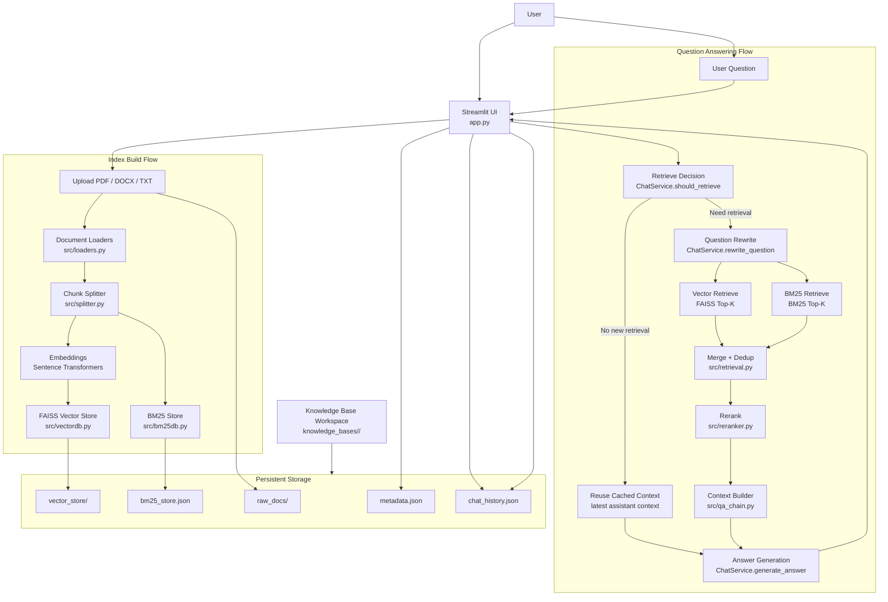

# Enterprise Knowledge Base QA Architecture

This document describes the current architecture of the RAG demo after the hybrid retrieval upgrade.

## System Overview



## Knowledge Base Layout

Each knowledge base is isolated under its own directory:

```text
knowledge_bases/
  <knowledge_base_id>/
    metadata.json
    raw_docs/
    vector_store/
    bm25_store.json
    chat_history.json
```

## Build Flow

1. The user uploads documents in the Streamlit UI.
2. `src/loaders.py` parses `PDF`, `DOCX`, and `TXT` content.
3. `src/splitter.py` splits documents into chunks and assigns:
   - `chunk_index`
   - `chunk_id`
4. `Sentence Transformers` embeddings are generated for each chunk.
5. `src/vectordb.py` builds and persists the FAISS vector index.
6. `src/bm25db.py` builds and persists the BM25 lexical index.

## Query Flow

1. The user submits a question.
2. `ChatService.should_retrieve(...)` decides whether the turn needs fresh retrieval.
3. If retrieval is not needed, the system reuses the cached context from the latest assistant turn.
4. If retrieval is needed:
   - `ChatService.rewrite_question(...)` rewrites the question into a standalone retrieval query.
   - FAISS performs semantic retrieval.
   - BM25 performs lexical retrieval.
   - `src/retrieval.py` merges and deduplicates both result sets.
   - `src/reranker.py` reranks the merged candidates with a cross-encoder model.
   - `src/qa_chain.py` builds the final context from the top-ranked chunks.
5. `ChatService.generate_answer(...)` generates the answer from:
   - conversation history
   - selected context chunks
6. The assistant answer, sources, retrieval mode, and context are appended to `chat_history.json`.

## Main Modules

- [app.py](</d:/Users/qwcc3/Desktop/code repository/RAG/rag-demo/app.py>)
  Streamlit UI, build flow, query flow, and chat persistence.

- [src/loaders.py](</d:/Users/qwcc3/Desktop/code repository/RAG/rag-demo/src/loaders.py>)
  Loads raw document text from supported file types.

- [src/splitter.py](</d:/Users/qwcc3/Desktop/code repository/RAG/rag-demo/src/splitter.py>)
  Splits documents into chunks and adds chunk metadata.

- [src/vectordb.py](</d:/Users/qwcc3/Desktop/code repository/RAG/rag-demo/src/vectordb.py>)
  Builds and loads the FAISS vector store.

- [src/bm25db.py](</d:/Users/qwcc3/Desktop/code repository/RAG/rag-demo/src/bm25db.py>)
  Builds, persists, loads, and queries the BM25 store.

- [src/retrieval.py](</d:/Users/qwcc3/Desktop/code repository/RAG/rag-demo/src/retrieval.py>)
  Hybrid retrieval and candidate deduplication.

- [src/reranker.py](</d:/Users/qwcc3/Desktop/code repository/RAG/rag-demo/src/reranker.py>)
  Cross-encoder reranking for merged retrieval candidates.

- [src/qa_chain.py](</d:/Users/qwcc3/Desktop/code repository/RAG/rag-demo/src/qa_chain.py>)
  Orchestrates retrieve decision, retrieval, reranking, context build, and answer generation.

- [src/llm_service.py](</d:/Users/qwcc3/Desktop/code repository/RAG/rag-demo/src/llm_service.py>)
  Encapsulates DeepSeek chat calls, question rewrite, and retrieve decision logic.

- [src/knowledge_base.py](</d:/Users/qwcc3/Desktop/code repository/RAG/rag-demo/src/knowledge_base.py>)
  Knowledge base directory model and chat history persistence.

## Retrieval Strategy Summary

- `BM25`: catches exact terms, names, and keyword-heavy queries.
- `Vector retrieval`: catches semantic similarity and paraphrased questions.
- `Rerank`: improves ordering quality among merged candidates.
- `Cached context reuse`: avoids unnecessary retrieval on follow-up turns.

## Recommended Resume Summary

Implemented a multi-knowledge-base RAG system with hybrid retrieval (`BM25 + FAISS`) and cross-encoder reranking, supporting document ingestion, isolated indexing, multi-turn chat, retrieval-on-demand, and source-grounded answer generation.
