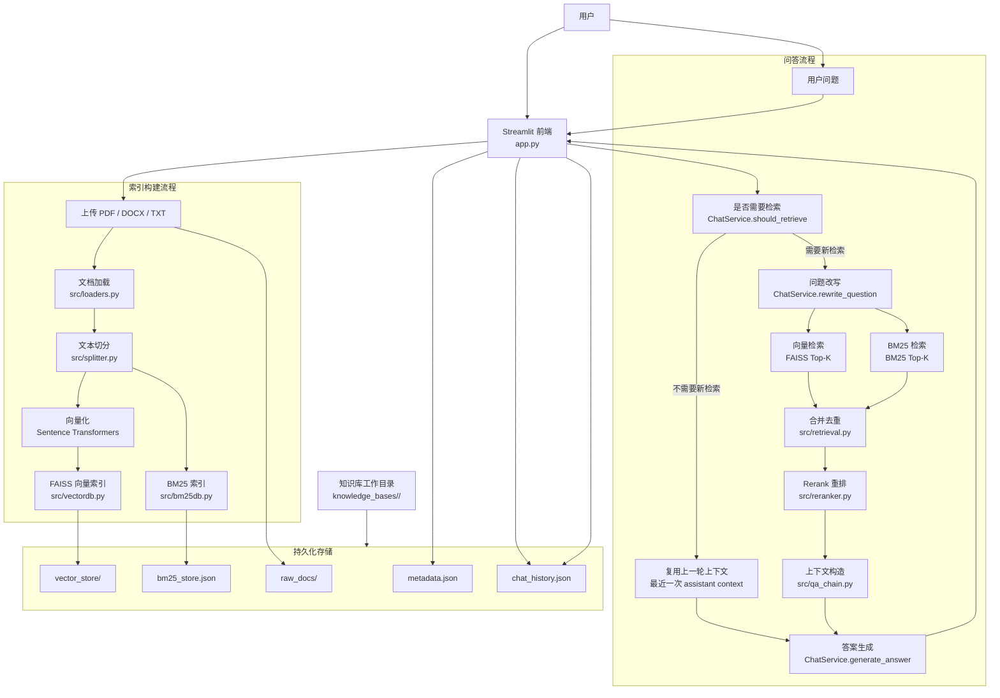

# 企业知识库问答系统架构说明

本文档描述当前 RAG 项目的整体架构。当前版本已经支持 `BM25 + 向量检索 + Rerank` 的混合检索链路。

## 一、系统总览



## 二、知识库目录结构

每个知识库独立保存，目录结构如下：

```text
knowledge_bases/
  <knowledge_base_id>/
    metadata.json
    raw_docs/
    vector_store/
    bm25_store.json
    chat_history.json
```

各文件含义如下：

- `metadata.json`：知识库元信息，如 `id`、名称、创建时间
- `raw_docs/`：用户上传的原始文档
- `vector_store/`：FAISS 向量索引
- `bm25_store.json`：BM25 检索所需的持久化文档数据
- `chat_history.json`：当前知识库的独立对话历史

## 三、索引构建流程

当用户上传文档并点击“构建知识库”后，系统执行以下流程：

1. 在前端上传 `PDF / DOCX / TXT` 文档
2. `src/loaders.py` 解析不同格式文档内容
3. `src/splitter.py` 对文档进行切分，生成多个 `chunk`
4. 每个 `chunk` 附带如下元数据：
   - `chunk_index`
   - `chunk_id`
   - `source`
5. 使用 `Sentence Transformers` 生成向量表示
6. `src/vectordb.py` 构建并保存 FAISS 向量索引
7. `src/bm25db.py` 构建并保存 BM25 索引

这样，每个知识库都会同时拥有：

- 一套语义检索能力：`FAISS`
- 一套关键词检索能力：`BM25`

## 四、问答流程

当用户发起提问后，系统执行如下链路：

1. 前端接收用户问题
2. `ChatService.should_retrieve(...)` 判断当前问题是否需要重新检索知识库
3. 如果不需要检索：
   - 直接复用上一轮 assistant 消息中缓存的 `context`
4. 如果需要检索：
   - `ChatService.rewrite_question(...)` 将追问改写为独立检索问题
   - FAISS 执行向量检索，召回一批候选片段
   - BM25 执行关键词检索，召回一批候选片段
   - `src/retrieval.py` 对两路结果进行合并与去重
   - `src/reranker.py` 使用 cross-encoder 模型对候选结果进行重排
   - `src/qa_chain.py` 从重排后的结果中选取 Top-K 构造上下文
5. `ChatService.generate_answer(...)` 基于：
   - 对话历史
   - 检索上下文
   生成最终答案
6. 将答案、来源、检索方式和上下文写入 `chat_history.json`

## 五、核心模块说明

- [app.py](</d:/Users/qwcc3/Desktop/code repository/RAG/rag-demo/app.py>)
  前端页面、文档上传、知识库构建、提问入口、会话持久化

- [src/loaders.py](</d:/Users/qwcc3/Desktop/code repository/RAG/rag-demo/src/loaders.py>)
  负责加载不同格式的原始文档内容

- [src/splitter.py](</d:/Users/qwcc3/Desktop/code repository/RAG/rag-demo/src/splitter.py>)
  负责文本切分，并给每个 chunk 添加元数据

- [src/vectordb.py](</d:/Users/qwcc3/Desktop/code repository/RAG/rag-demo/src/vectordb.py>)
  负责 FAISS 向量索引的构建、加载与检索

- [src/bm25db.py](</d:/Users/qwcc3/Desktop/code repository/RAG/rag-demo/src/bm25db.py>)
  负责 BM25 索引的构建、加载与检索

- [src/retrieval.py](</d:/Users/qwcc3/Desktop/code repository/RAG/rag-demo/src/retrieval.py>)
  负责混合召回及候选结果去重

- [src/reranker.py](</d:/Users/qwcc3/Desktop/code repository/RAG/rag-demo/src/reranker.py>)
  负责对召回结果进行 rerank 重排

- [src/qa_chain.py](</d:/Users/qwcc3/Desktop/code repository/RAG/rag-demo/src/qa_chain.py>)
  负责串联检索决策、问题改写、混合检索、重排、上下文构造和答案生成

- [src/llm_service.py](</d:/Users/qwcc3/Desktop/code repository/RAG/rag-demo/src/llm_service.py>)
  负责调用 DeepSeek 接口，实现检索决策、问题改写和最终答案生成

- [src/knowledge_base.py](</d:/Users/qwcc3/Desktop/code repository/RAG/rag-demo/src/knowledge_base.py>)
  负责知识库目录管理和聊天记录持久化

## 六、检索策略说明

当前系统采用混合检索策略，各部分职责如下：

- `BM25`
  适合命中术语、制度名称、字段名、编号等关键词明确的问题

- `向量检索`
  适合命中语义相近、表达方式不同、带自然语言改写的问题

- `Rerank`
  负责对候选结果重新排序，把真正最能回答问题的片段排在前面

- `上下文复用`
  针对“继续解释”“总结一下”“展开说说”这类追问，减少不必要的重复检索

## 七、系统特点

本系统当前具备以下特点：

- 支持多知识库隔离
- 支持 `PDF / DOCX / TXT` 文档接入
- 支持多轮对话
- 支持按需检索
- 支持 `BM25 + 向量检索 + Rerank`
- 支持来源追踪与上下文落盘

## 八、适合写在简历上的一句话总结

实现了一个基于 RAG 的企业知识库问答系统，支持多知识库隔离、多轮对话、按需检索，并采用 `BM25 + FAISS + Cross-Encoder Rerank` 的混合检索链路提升企业文档场景下的召回与排序效果。
